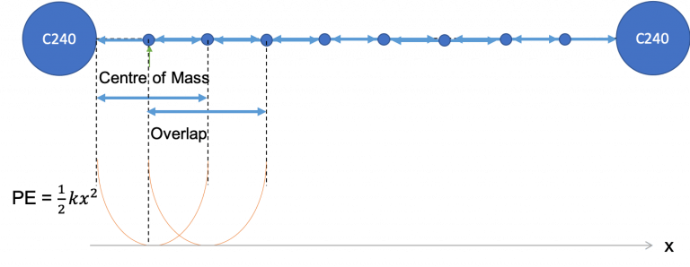
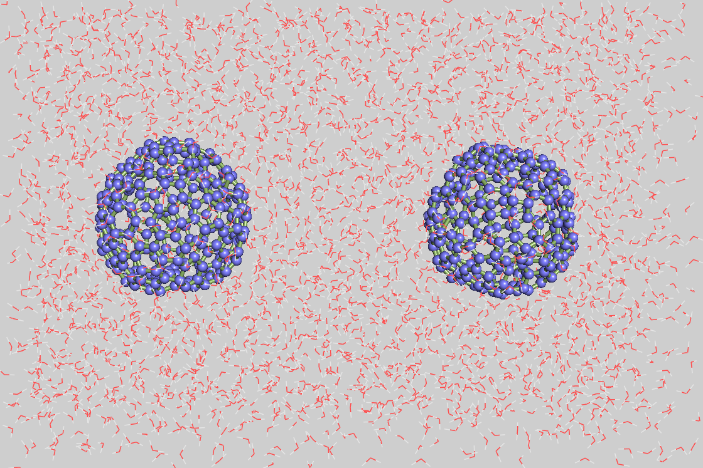

# 胶体在水中的模拟

> 预告：
>
> 笔者之前一直做蛋白配体模拟，因此正在写蛋白配体全流程模拟的相关推送文章。
>
> 该系列文章预计会出11期，从蛋白配体准备、分子对接到结果分析。
>
> 该文章主要以gromacs为模拟软件，以手把手傻瓜式教学为目的，同时最后几期将会涉及增强采样方法和Amber的使用。
>
> 目前已经写到了第二期。。。。。后续会一次性推送，敬请期待（临近毕业，可能会鸽）

教程来源：[Colloidal forces | MD Simulation Techniques and Applications (psu.edu)](https://sites.psu.edu/simtech/depletion-attraction/)

水中的胶体粒子可以通过多种可能的力进行相互作用，包括范德华力、库仑相互作用、氢键相互作用等。周围的溶质也会影响相互作用势能。要了解有无溶质的势能依赖性，以及胶体颗粒之间的吸引或排斥关系，不同分离距离的平均力势 (PMF) 是我们要研究的关键因素。通过保持粒子相对于不同的相对距离，我们可以了解胶体耗尽力的潜在趋势。



可以使用Gromacs考察不同离子以及它们浓度对胶体粒子之间作用力的影响。

在此体系中，仅探讨空心球状粒子C240。模拟的具体参数：恒定体积（4\*4\*6 nm<sup>3</sup>），温度 300K。

因篇幅问题，溶质离子为1 M的铵根离子(NH<sub>4</sub><sup>+</sup>)和硝酸根离子(NO<sub>3</sub><sup>-</sup>)的情况暂不讨论，读者可以在构建完体系之后，使用`gmx solvate`命令将水替换为溶质粒子，并修改topol文件即可。


## 体系搭建

体系包括了两个空心的C240球溶解于水中。从文献中可知，C240的直径为1.5 nm。因此为了选取两个C240之间的相互作用，模拟盒子选取为4\*4\*6。

为了防止水被添加到C240球内，两个dummy原子被放在C240中心(`gmx insert-molecule`)。

然后溶剂化体系(排斥半径为0.75 nm，`gmx solvate -radius 0.75`)。

使用`gmx trjconv`移除dummy原子。

C240使用`gmx insert-molecule`放置在盒子内。

由于分子非常大并与周围的水分子相互作用，因此在插入过程中范德瓦尔斯半径被设置为 0（-scale 0）。



### 构建dummy原子gro

打开一个文本文件，填入如下内容即可，命名为`dummy.gro`。（gro文件有严格的格式要求）

```tex
dummy atoms
    2
    1dum    dum    1   2.000   2.000   1.500
    2dum    dum    2   2.000   2.000   4.500
   4.00000   4.00000   6.00000
```

该`gro`文件包含两个dummy原子，命名为dum。

### 构建C240gro文件

`# C240.gro`文件在文末给出。

打开gromacs文件夹中的力场所在文件`share\gromacs\top\oplsaa.ff`，采用的力场为`oplsaa.ff`

创建一个新的文件`C240.n2t`，输入如下文件：

`# C240.n2t`

```tex
C    opls_141B   0.00      12.011  3    C 0.140   C 0.140   C 0.140
```

该文件说明，如果体系中的任何一个碳原子与周围三个碳原子的距离都在0.140nm左右，就把它当作opls_14B原子类型，其电荷为0，摩尔质量为12.011。

接着在工作目录使用`gmx x2top`生成top

```bash
gmx x2top -f C240.gro -o c240.top -ff oplsaa -name c240
```

将`c240.top`复制为`c240.itp`，打开`itp`文件，删除`[system]`和`[molecules]` block 以及开头的`#include`一行。

### 搭建模拟体系

1. 溶剂化dummy原子，需要记住加的水分子数，后续编写topol需要用到。

    ```bash
    gmx solvate -cp dummy.gro -o dummy_solvate.gro -radius 0.75 
    ```
    可以通过vmd或者pymol查看构建的体系
    ```bash
    vmd dummy_solvate.gro
    ```

2. 去除体系中的dummy原子，输出文件为`only_water.gro`

    ```bash
    gmx trjconv -f dummy_solvate.gro -s dummy_solvate.gro -o only_water.gro
    ```

3. 将`c240.gro`居中

    ```bash
     gmx editconf -f C240.gro -o c240.gro -center 0 0 0
    ```

4. 将C240分子加入体系中
    首先创建C240分子添加位置文件`position.dat`

    ```tex
    2 2 1.5
    2 2 4.5
    ```

    其次，插入分子

    ```bash
    gmx insert-molecules -ci c240.gro -ip position.dat -o c240_solvate.gro -nmol 2 -f only_water.gro -dr 0 0 0 -scale 0
    ```

    - `-f`：被插入文件
    - `-ci`：插入分子结构文件
    - `-ip`：定义插入分子位置
    - `-nmol`：插入分子数目
    - `-dr`：从 -ip 文件中的位置允许的 x/y/z 位移
    - `-scale`：乘以范德华半径的放缩因子，默认为0.57
    - `-o`：输出gro文件

5. 构建体系topol

    `# topol.top`

    ```tex
    #include "oplsaa.ff/forcefield.itp"
    #include "overrides.itp"
    #include "oplsaa.ff/spce.itp"
    #include "c240.itp"
    
    [ system ]
    ; Name
    Colloid
    
    [ molecules ]
    ; Compound	#mols
    SOL		3019 # 该原子数由第一步给出
    C240		2
    ```

    `# overrides.itp`

    ```tex
    [ atomtypes ]
    ; name bond_type mass charge ptype sigma epsilon
    opls_141B C3 6 12.01100 0.000 A 3.47000e-01 2.76470e-01
    opls_0    DM 1  1.00000 0.000 A 0.00000e+00 0.00000e+00
    
    [ bondtypes ]
    ; i j func b0 kb
      C3 C3 1 0.14200 265265.6
    
    [ angletypes ]
    ; i j k func th0 cth
      C3 C3 C3 1 114.000 488.273 ;
    
    [ dihedraltypes ]
    ; i j k l func coefficients
      C3 C3 C3 C3 3 -4.96013 6.28646 1.30959 -2.63592 0.00000 0.00000 ;fullerene
    ```

    

## 平衡

### EM

> C240的位置必须被冻结

`# em.mdp`

    define			 = -DFLEXIBLE
    freezegrps               = C24       ; 冻结原子组
    freezedim                = Y Y Y     ; 在XYZ方向均冻结
    
    integrator               = steep    ; Algorithm (steep =steepest descent minimization)
    emtol                    = 100      ; Energy tolerance for stop minimization  < 100.0 kJ/mol/nm
    emstep                   = 0.01     ; Minimization step sizes
    nsteps                   = 50000    ; Mazimum number of (minimization) steps to perform
    nstcgsteep               = 1000      ; Frequency of steepest decent step
    nstcomm                  = 1        ; Center of mass motion removal interval (timesteps)
    
    ; Output control
    nstxout                  = 500
    nstlog                   = 500
    nstenergy                = 500
    
    ; cutoffs
    cutoff-scheme            = verlet
    nstlist                  = 20
    ns_type                  = grid
    pbc                      = xyz
    rlist                    = 1.1
    coulombtype              = PME 
    rcoulomb                 = 1.1
    vdwtype                  = cutoff
    rvdw                     = 1.1
    
    ; bond constraints
    constraints              = none    ;tutorials use h-bonds
    constraint-algorithm     = lincs
    
    ; temp and pressure control
    tcoupl			 = no
    pcoupl			 = no

```
gmx grompp -f em.mdp -c c240_solvate.gro -p topol.top -o em.tpr -maxwarn 5
gmx mdrun -v -deffnm em
```

### NVT

`# nvt.mdp`

> 此处输出的轨迹文件为trr格式，使用`nstxout`设置
>
> 如需使用xtc格式，设置`nstxout-compressed`

    ; Run control
    freezegrps		 = C24
    freezedim		 = Y Y Y
    integrator               = md       
    tinit                    = 0
    dt                       = 0.002
    nsteps                   = 50000   ; 0.1 ns
    
    ; Output control
    nstxout                  = 2500
    nstlog                   = 2500
    nstenergy                = 25
    
    ; cutoffs
    cutoff-scheme            = verlet
    nstlist                  = 20
    ns_type                  = grid
    pbc                      = xyz
    rlist                    = 1.2
    coulombtype              = PME ;cutoff ; no charges
    rcoulomb                 = 1.2
    vdwtype                  = cutoff
    rvdw                     = 1.2
    
    ; Temperature coupling
    tcoupl			 = v-rescale
    tc_grps                  = system
    tau_t                    = 0.1
    ref_t                    = 300
    
    ; Pressure coupling
    Pcoupl			 = no
    tau_p                    = 1.0
    compressibility          = 4.5e-05
    ref_p                    = 1.0 
    
    ; bond constraints
    constraints              = none
    constraint-algorithm     = lincs

```
gmx grompp -f nvt.mdp -c em.gro -p topol.top -o nvt.tpr -maxwarn 3
gmx mdrun -v -deffnm nvt -nt 10
```

### NPT

通过`pull`选项，对C240s施加一个soft potential，设定弹性常数为6000 [kJ mol-1 nm-1] ，使粒子质心移动限制在0.1A范围内

> ! WARNING
>
> 使用过程中可能出现如下问题
>
> ```tex
> ERROR 1 [file npt.mdp]:
>   When the maximum distance from a pull group reference atom to other atoms
>   in the group is larger than 0.5 times half the box size a centrally
>   placed atom should be chosen as pbcatom. Pull group 2 is larger than that
>   and does not have a specific atom selected as reference atom.
> ```
>
> [ResearchGate](https://www.researchgate.net/post/Getting_error_in_Steered_Molecular_Dynamics_Simulation_in_GROMACS_2020)论坛上给出的答案
>
> > This means that group 1 is very large and some atoms in that group are distant from each other more than 0.5 times the box size. This is a problem for GROMACS when it tries to calculate distances, since PBC are on and the true distance is not well defined anymore.
> >
> > Try to visualize group 1 with some tool like VMD and try to find an atom that is ca. at the centre of your group 1. Take that atom number from the .gro/.pdb/your structure file and then add the option
> >
> > **pull-group1-pbcatom = #number_of_your_central_atom**
> >
> > to your mdp file ([https://manual.gromacs.org/documentation/2018/user-guide/mdp-options.html#com-pulling](https://www.researchgate.net/deref/https%3A%2F%2Fmanual.gromacs.org%2Fdocumentation%2F2018%2Fuser-guide%2Fmdp-options.html%23com-pulling)).
> >
> > When you do not specify this option, gromacs just searches for the central atom in the group from the list, i.e., if you have a group of 10 atoms gromacs uses the fifth, which does not correspond necessarily with the geometrical centre of your group. This usually is not a problem, but when groups are larger than half the box then the choice could be not ideal to calculate distances with PBC, and so you have to specify a better atom for gromacs to use.
>
> 也就说只需要在mdp文件中加入`pull-group1-pbcatom = #number_of_your_central_atom`即可，该原子编号为你指定group的中心原子！
>
> 注意根据体系的不同，需要自己选择！！！！！

`# npt.mdp`

    ; Run control
    integrator               = md       
    tinit                    = 0
    dt                       = 0.002
    nsteps                   = 50000   ; 0.1 ns
    
    ; Output control
    nstxout                  = 2500
    nstlog                   = 2500
    nstenergy                = 25
    
    ; cutoffs
    cutoff-scheme            = verlet
    nstlist                  = 20
    ns_type                  = grid
    pbc                      = xyz
    rlist                    = 1.2
    coulombtype              = PME ;cutoff ; no charges
    rcoulomb                 = 1.2
    vdwtype                  = cutoff
    rvdw                     = 1.2
    
    ; Temperature coupling
    tcoupl			 = v-rescale
    tc_grps                  = system
    tau_t                    = 0.1
    ref_t                    = 300
    
    ; Pressure coupling
    Pcoupl                   = berendsen
    tau_p                    = 1.0
    compressibility          = 4.5e-05
    ref_p                    = 1.0 
    
    ; bond constraints
    constraints              = none
    constraint-algorithm     = lincs
    
    ; pull on all the ions
    pull=yes
    pull-ngroups=2              ; 拉伸组为两个
    pull-group1-name=C24_1      ; 组名
    pull-group2-name=C24_2
    pull-ncoords=2              ; 拉伸坐标数
    
    pull-coord1-type=umbrella    ; 拉伸类型
    pull-coord1-geometry=distance     ; 沿着连接两组的矢量方向拉动。
    pull-coord1-groups=0 1       ; 拉伸组索引，0表示使用原始坐标为参考
    pull-group1-pbcatom=9085
    pull-coord1-origin=2 2 1.5   ; 初始坐标位置
    pull-coord1-dim=Y Y Y        ; X Y Z方向是否拉伸，Y为拉伸，N为否
    pull-coord1-k=6000           ; 力常数
    
    pull-coord2-type=umbrella
    pull-coord2-geometry=distance
    pull-coord2-groups=0 2
    pull-group2-pbcatom=9382
    pull-coord2-origin=2 2 4.5
    pull-coord2-dim=Y Y Y
    pull-coord2-k=6000

制作每个C240的index用作pull group
输入`l`显示所有残基，选择C240残基并重命名

```bash
> gmx make_ndx -f nvt.gro -o C24.ndx
> l
> ri 3020
> ri 3021
> name 6 C24_1
> name 7 C24_2
> q
```

```bash
gmx grompp -f npt.mdp -c nvt.gro -n c240.ndx -o npt.tpr -maxwarn 5
gmx mdrun -v -deffnm npt -nt 10
```


## Distance Loop

当走完上述步骤之后，体系已经平衡的很好。下一步进行C240s相距不同距离的模拟。其中一个C240使用soft potentail被固定在原位置。另一个原子被施加力拉伸到指定距离`DISTANCE`。弹性常数由分子的活动范围决定。其中分子1在z方向上能够活动0.5A，x、y方向只能活动0.1A。相应地，分子2被固定在原位置，其只能活动0.1A。

`# md.mdp`

```tex
; Run control
integrator               = md 
dt                       = 0.002
nsteps                   = 500000   ; 1ns

; random seeds
;ld-seed		 = 12345
;gen-seed		 = 12345

; Output control
nstxout                  = 500
nstlog                   = 25000
nstenergy                = 500

; Neighbor searching
nstlist                  = 20
ns_type                  = grid
pbc                      = xyz

; cutoff related
cutoff-scheme		 = verlet
rlist			 = 1.5
coulombtype              = PME
rcoulomb                 = 1.5
vdwtype			 = cutoff
rvdw			 = 1.5

; Temperature coupling
tcoupl			 = v-rescale
tc_grps                  = system
tau_t                    = 0.1
ref_t                    = 300

; Pressure coupling
pcoupl              =  no
; pcou              =  berendsen
tau_p               =  1.
compressibility     =  5.0e-5
ref_p               =  1.0

; pull on all the ions
pull-pbc-ref-prev-step-com=yes
pull = yes
pull-ngroups = 2
pull-group1-name=C24_1
pull-group2-name = C24_2
pull-ncoords = 3
pull-nstxout=50
pull-nstfout=50

pull-coord1-type = umbrella
pull-coord1-geometry = direction-periodic
pull-coord1-groups = 1 2
pull-coord1-vec = 0 0 1
pull-coord1-init=DISTANCE
pull-coord1-dim = N N Y
pull-coord1-k = 1000

pull-coord2-type = umbrella
pull-coord2-geometry = distance
pull-coord2-groups = 0 1
pull-coord2-origin = 2 2 1.5
pull-group1-pbcatom=9085
pull-coord2-dim = Y Y N
pull-coord2-k = 1000

pull-coord3-type = umbrella
pull-coord3-geometry = distance
pull-coord3-groups = 0 2
pull-group2-pbcatom=9382
pull-coord3-origin = 2 2 4.5
pull-coord3-dim = Y Y Y
pull-coord3-k = 5000
```

创建文件夹，将需要的文件放入文件夹内

```bash
mkdir run
cd run
```

`# run.sh`

```tex
SYSTEM=$PWD
let NUM=0
INIT=$SYSTEM/npt.gro
while (($NUM<28))
do 
	mkdir prod_$NUM
    cd prod_$NUM
    XXX=`echo "3.0-$NUM*0.05" | bc`
    sed s/DISTANCE/$XXX/ < ../md.mdp > md.mdp
    gmx grompp -f md.mdp -c $INIT -n ../c240.ndx -p ../topol.top -o md.tpr -maxwarn 4
    gmx mdrun -v -nt 8 -deffnm md
    
    cd ..
    INIT=$SYSTEM/prod_$NUM/md.gro
    let NUM=$NUM+1
done
```


## 分析

### Pullx


查看每个设定DISTANCE的拉伸效果，即查看两个球是否按照我们设定的一样保持一定的距离。

Gromacs在pull模拟时会给出`md_pullx.xvg`，使用文本工具打开，可以看出我们设置了3个拉伸坐标，因此数据有四列，第一列：模拟时间；第二至四列：每个pull坐标的DISTANCE。

上图可能只想取观察某个坐标的变化，只需要修改`plt.plot(df[0], df2)`选择想要绘制的数据即可，例：`plt.plot(df[0], df[1])`

使用简单的python脚本`xvg_pullx.py`进行绘制

`# xvg_pullx.py`

```python
import pandas as pd
import numpy as np
import matplotlib.pyplot as plt
import re
import sys


def distance(dat):
   with open(dat) as f:
        lines = f.readlines()
        labelName = [l for l in lines if l.startswith('@')]
        data = [[float(i) for i in l.split()] for l in lines if not (
            l.startswith('#') or l.startswith('@'))]

    title = re.findall(r'\"([\w\d\s\(\)\/]+)\"', labelName[0])[0]
    xlabel = re.findall(r'\"([\w\d\s\(\)\/]+)\"', labelName[1])[0]
    ylabel = re.findall(r'\"([\w\d\s\(\)\/]+)\"', labelName[2])[0]
    df = pd.DataFrame(data)
    plt.figure(figsize=(15, 8))
    plt.gca().spines["top"].set_linewidth(2)
    plt.gca().spines["bottom"].set_linewidth(2)
    plt.gca().spines["left"].set_linewidth(2)
    plt.gca().spines["right"].set_linewidth(2)
    plt.rcParams.update({"font.size": 24})
    df2 = df.drop([0], axis=1)
    plt.plot(df[0], df2)
    plt.xticks(fontsize=20)
    plt.yticks(fontsize=20)
    plt.xlabel(xlabel, fontsize=24)
    plt.ylabel(ylabel, fontsize=24)
    plt.xlim(df[0].min(), df[0].max())
    plt.title(title, pad=12)
    plt.savefig('{}.png'.format(title),dpi=600)

if __name__ == '__main__':
    distance(sys.argv[1])
```

```bash
python xvg_pullx.py md_pullx.xvg
```

只需在相应文件夹执行上述命令即可生成pullx图。

### Pullf

pullf的代码与pullx类似，只需将`plt.plot(df[0], df[1])`更换为`plt.plot(df[0],df.drop([0],axis=1))`即可。

​    

### Position Histrogram

`# xvgextract.py`

```python
import pandas as pd
import numpy as np
import matplotlib.pyplot as plt
from matplotlib.pyplot import MultipleLocator
import os

def Histogram():
    total=pd.DataFrame()
    plt.figure(figsize=(35,8))
    for i in range(28):
        folders=os.getcwd()+"\prod_"+str(i)+"\md_pullx.xvg"
        with open(folders) as f:
            lines = f.readlines()
            labelName=[l for l in lines if l.startswith('@')]
            data=[[float(i) for i in l.split()] for l in lines if not (l.startswith('#') or l.startswith('@'))]
        df=pd.DataFrame(data)
        total.insert(loc=i,column=i,value=df[1])
        total[i].hist(stacked=True,bins=30,alpha=0.8,histtype="bar",edgecolor="black")
    plt.grid(None)
    plt.gca().spines["top"].set_linewidth(2)
    plt.gca().spines["bottom"].set_linewidth(2)
    plt.gca().spines["left"].set_linewidth(2)
    plt.gca().spines["right"].set_linewidth(2)
    plt.rcParams.update({"font.size":32})
    x_major_locator=MultipleLocator(0.1)
    plt.gca().xaxis.set_major_locator(x_major_locator)
    plt.xticks(fontsize=24)
    plt.yticks(fontsize=24)
    plt.xlabel("Position (nm)",fontsize=32)
    plt.ylabel("Counts",fontsize=32)
    plt.title("Position Histogram",pad=24,fontsize=32)
    plt.savefig('{}.png'.format("Histogram"),dpi=600)

if __name__ == '__main__':
    Histogram()
```
在run文件夹下运行该脚本可以获得如下图片，该图表示采样比较充分，同时在1.8 nm时，两球的排斥力最大，导致了Counts偏下，下面我们着重分析一下在1.8 nm处的相关轨迹。
```BASH
python xvgextract.py
```


### 临界值

打开文件夹prod_22(具体哪个文件夹根据自己的模拟情况而定)，运行上述分析力和position的代码。

可以看出，在1.8nm左右，因为我们设定的力常数无法限制两个球的位置，导致了突跃。也可以说明在该处两者的吸引力超过了弹簧拉力，C240不能维持原来的位置。

如果弹性常数设定的太大，产生的力会非常小，无法监测到该现象。相应的，当弹性常数过小时，无法将颗粒维持在固定位置。弹性常数可以由下述公式估算$k=k_b *T /\sigma^2$。


## 总结

本文从建模到构建拓扑到模拟，一步一步地完成了两个胶体分子的模拟。

通过控制两个胶体之间的距离，监测到了临界距离。

因为篇幅有限，所有并没有完成含有离子体系的模拟，但文末提供了阴阳离子的gro和itp文件。

作者水平有限，在行文过程中可能会出现各种各样的问题（包括但不限于原理性、撰写错误等），欢迎指正。


## 扩展

### C24.gro

```tex
Great Red Owns Many ACres of Sand 
  240
    1C24     C1    1   0.693  -0.039   0.184
    1C24     C2    2   0.690   0.099   0.175
    1C24     C3    3   0.644  -0.075   0.309
    1C24     C4    4   0.611   0.041   0.377
    1C24     C5    5   0.639   0.149   0.294
    1C24     C6    6   0.671   0.164   0.054
    1C24     C7    7   0.613   0.292   0.060
    1C24     C8    8   0.561   0.342   0.181
    1C24     C9    9   0.565   0.266   0.299
    1C24    C10   10   0.674   0.084  -0.062
    1C24    C11   11   0.677  -0.057  -0.052
    1C24    C12   12   0.678  -0.121   0.073
    1C24    C13   13   0.627  -0.250   0.096
    1C24    C14   14   0.577  -0.286   0.223
    1C24    C15   15   0.577  -0.194   0.330
    1C24    C16   16   0.485  -0.197   0.436
    1C24    C17   17   0.451  -0.079   0.505
    1C24    C18   18   0.508   0.045   0.469
    1C24    C19   19   0.445   0.169   0.488
    1C24    C20   20   0.473   0.278   0.404
    1C24    C21   21   0.640   0.145  -0.183
    1C24    C22   22   0.607   0.281  -0.180
    1C24    C23   23   0.580   0.353  -0.062
    1C24    C24   24   0.476   0.454   0.179
    1C24    C25   25   0.402   0.480   0.296
    1C24    C26   26   0.389   0.390   0.403
    1C24    C27   27   0.597  -0.328  -0.016
    1C24    C28   28   0.621  -0.272  -0.142
    1C24    C29   29   0.648  -0.136  -0.164
    1C24    C30   30   0.498  -0.401   0.237
    1C24    C31   31   0.425  -0.415   0.356
    1C24    C32   32   0.406  -0.312   0.450
    1C24    C33   33   0.338  -0.076   0.587
    1C24    C34   34   0.290   0.050   0.627
    1C24    C35   35   0.332   0.172   0.571
    1C24    C36   36   0.614  -0.074  -0.287
    1C24    C37   37   0.611   0.066  -0.296
    1C24    C38   38   0.494   0.465  -0.063
    1C24    C39   39   0.443   0.515   0.057
    1C24    C40   40   0.246   0.284   0.569
    1C24    C41   41   0.274   0.392   0.486
    1C24    C42   42   0.292  -0.309   0.533
    1C24    C43   43   0.258  -0.192   0.601
    1C24    C44   44   0.468  -0.480   0.124
    1C24    C45   45   0.517  -0.444  -0.002
    1C24    C46   46   0.561   0.337  -0.298
    1C24    C47   47   0.531   0.259  -0.409
    1C24    C48   48   0.429   0.321  -0.479
    1C24    C49   49   0.395   0.437  -0.411
    1C24    C50   50   0.477   0.447  -0.299
    1C24    C51   51   0.309   0.582   0.288
    1C24    C52   52   0.276   0.642   0.168
    1C24    C53   53   0.143   0.682   0.175
    1C24    C54   54   0.094   0.647   0.299
    1C24    C55   55   0.196   0.584   0.369
    1C24    C56   56   0.578  -0.345  -0.252
    1C24    C57   57   0.545  -0.285  -0.372
    1C24    C58   58   0.446  -0.361  -0.433
    1C24    C59   59   0.418  -0.468  -0.350
    1C24    C60   60   0.499  -0.458  -0.238
    1C24    C61   61   0.336  -0.521   0.363
    1C24    C62   62   0.307  -0.599   0.252
    1C24    C63   63   0.176  -0.644   0.265
    1C24    C64   64   0.125  -0.595   0.384
    1C24    C65   65   0.224  -0.518   0.444
    1C24    C66   66   0.170   0.052   0.697
    1C24    C67   67   0.091  -0.062   0.710
    1C24    C68   68  -0.041  -0.022   0.717
    1C24    C69   69  -0.045   0.116   0.708
    1C24    C70   70   0.086   0.162   0.695
    1C24    C71   71   0.364  -0.575   0.128
    1C24    C72   72   0.194  -0.409   0.524
    1C24    C73   73   0.459  -0.505  -0.114
    1C24    C74   74   0.553  -0.147  -0.390
    1C24    C75   75   0.546   0.121  -0.408
    1C24    C76   76   0.434   0.508  -0.183
    1C24    C77   77   0.335   0.605   0.048
    1C24    C78   78   0.171   0.486   0.463
    1C24    C79   79   0.117   0.277   0.624
    1C24    C80   80   0.128  -0.184   0.655
    1C24    C81   81   0.096  -0.668   0.155
    1C24    C82   82   0.158  -0.662   0.029
    1C24    C83   83   0.291  -0.616   0.016
    1C24    C84   84  -0.009  -0.566   0.399
    1C24    C85   85  -0.042  -0.468   0.494
    1C24    C86   86   0.058  -0.390   0.556
    1C24    C87   87  -0.043  -0.658   0.175
    1C24    C88   88  -0.095  -0.607   0.296
    1C24    C89   89   0.340  -0.580  -0.110
    1C24    C90   90   0.258  -0.590  -0.224
    1C24    C91   91   0.292  -0.525  -0.344
    1C24    C92   92   0.199  -0.482  -0.440
    1C24    C93   93   0.227  -0.372  -0.524
    1C24    C94   94   0.350  -0.304  -0.514
    1C24    C95   95   0.368  -0.169  -0.549
    1C24    C96   96   0.468  -0.091  -0.487
    1C24    C97   97   0.465   0.048  -0.496
    1C24    C98   98   0.361   0.112  -0.568
    1C24    C99   99   0.336   0.249  -0.552
    1C24   C100  100   0.210   0.309  -0.570
    1C24   C101  101   0.176   0.427  -0.501
    1C24   C102  102   0.266   0.488  -0.413
    1C24   C103  103   0.228   0.567  -0.303
    1C24   C104  104   0.311   0.576  -0.189
    1C24   C105  105   0.260   0.627  -0.069
    1C24   C106  106   0.125   0.668  -0.062
    1C24   C107  107   0.062   0.687   0.063
    1C24   C108  108  -0.076   0.672   0.084
    1C24   C109  109  -0.126   0.636   0.211
    1C24   C110  110  -0.039   0.613   0.319
    1C24   C111  111   0.037   0.464   0.498
    1C24   C112  112  -0.067   0.527   0.427
    1C24   C113  113   0.024  -0.273   0.625
    1C24   C114  114  -0.111  -0.232   0.632
    1C24   C115  115  -0.144  -0.101   0.670
    1C24   C116  116   0.009   0.356   0.582
    1C24   C117  117  -0.124   0.309   0.595
    1C24   C118  118  -0.151   0.183   0.651
    1C24   C119  119  -0.261  -0.035   0.629
    1C24   C120  120  -0.265   0.106   0.619
    1C24   C121  121  -0.644   0.075  -0.309
    1C24   C122  122  -0.611  -0.041  -0.376
    1C24   C123  123  -0.693   0.039  -0.184
    1C24   C124  124  -0.690  -0.099  -0.175
    1C24   C125  125  -0.639  -0.149  -0.294
    1C24   C126  126  -0.508  -0.045  -0.469
    1C24   C127  127  -0.445  -0.169  -0.488
    1C24   C128  128  -0.473  -0.278  -0.404
    1C24   C129  129  -0.565  -0.266  -0.298
    1C24   C130  130  -0.451   0.079  -0.505
    1C24   C131  131  -0.485   0.197  -0.436
    1C24   C132  132  -0.577   0.194  -0.330
    1C24   C133  133  -0.577   0.286  -0.223
    1C24   C134  134  -0.627   0.250  -0.096
    1C24   C135  135  -0.678   0.121  -0.073
    1C24   C136  136  -0.677   0.057   0.052
    1C24   C137  137  -0.674  -0.084   0.062
    1C24   C138  138  -0.671  -0.164  -0.054
    1C24   C139  139  -0.613  -0.292  -0.059
    1C24   C140  140  -0.561  -0.342  -0.181
    1C24   C141  141  -0.338   0.076  -0.587
    1C24   C142  142  -0.290  -0.050  -0.627
    1C24   C143  143  -0.332  -0.172  -0.571
    1C24   C144  144  -0.389  -0.390  -0.402
    1C24   C145  145  -0.402  -0.480  -0.296
    1C24   C146  146  -0.476  -0.454  -0.179
    1C24   C147  147  -0.498   0.401  -0.237
    1C24   C148  148  -0.425   0.415  -0.356
    1C24   C149  149  -0.406   0.312  -0.450
    1C24   C150  150  -0.597   0.328   0.016
    1C24   C151  151  -0.621   0.272   0.142
    1C24   C152  152  -0.648   0.136   0.164
    1C24   C153  153  -0.641  -0.145   0.183
    1C24   C154  154  -0.607  -0.281   0.180
    1C24   C155  155  -0.580  -0.353   0.062
    1C24   C156  156  -0.292   0.309  -0.533
    1C24   C157  157  -0.258   0.192  -0.601
    1C24   C158  158  -0.246  -0.284  -0.569
    1C24   C159  159  -0.274  -0.392  -0.485
    1C24   C160  160  -0.495  -0.465   0.063
    1C24   C161  161  -0.443  -0.515  -0.057
    1C24   C162  162  -0.614   0.074   0.287
    1C24   C163  163  -0.611  -0.066   0.296
    1C24   C164  164  -0.517   0.444   0.002
    1C24   C165  165  -0.468   0.480  -0.124
    1C24   C166  166  -0.170  -0.052  -0.696
    1C24   C167  167  -0.092   0.062  -0.710
    1C24   C168  168   0.041   0.022  -0.717
    1C24   C169  169   0.044  -0.116  -0.708
    1C24   C170  170  -0.086  -0.162  -0.695
    1C24   C171  171  -0.309  -0.582  -0.288
    1C24   C172  172  -0.196  -0.584  -0.369
    1C24   C173  173  -0.094  -0.647  -0.299
    1C24   C174  174  -0.143  -0.682  -0.175
    1C24   C175  175  -0.276  -0.642  -0.168
    1C24   C176  176  -0.336   0.521  -0.363
    1C24   C177  177  -0.224   0.518  -0.444
    1C24   C178  178  -0.125   0.595  -0.384
    1C24   C179  179  -0.177   0.644  -0.265
    1C24   C180  180  -0.307   0.599  -0.252
    1C24   C181  181  -0.578   0.345   0.252
    1C24   C182  182  -0.499   0.458   0.238
    1C24   C183  183  -0.418   0.468   0.350
    1C24   C184  184  -0.446   0.361   0.433
    1C24   C185  185  -0.545   0.284   0.372
    1C24   C186  186  -0.561  -0.337   0.298
    1C24   C187  187  -0.531  -0.259   0.409
    1C24   C188  188  -0.429  -0.321   0.479
    1C24   C189  189  -0.395  -0.437   0.411
    1C24   C190  190  -0.477  -0.447   0.300
    1C24   C191  191  -0.459   0.505   0.114
    1C24   C192  192  -0.553   0.147   0.390
    1C24   C193  193  -0.364   0.575  -0.128
    1C24   C194  194  -0.194   0.409  -0.524
    1C24   C195  195  -0.128   0.184  -0.655
    1C24   C196  196  -0.117  -0.277  -0.624
    1C24   C197  197  -0.172  -0.486  -0.463
    1C24   C198  198  -0.335  -0.605  -0.048
    1C24   C199  199  -0.434  -0.508   0.183
    1C24   C200  200  -0.546  -0.121   0.408
    1C24   C201  201  -0.292   0.525   0.344
    1C24   C202  202  -0.258   0.590   0.224
    1C24   C203  203  -0.341   0.580   0.110
    1C24   C204  204  -0.350   0.304   0.514
    1C24   C205  205  -0.368   0.169   0.549
    1C24   C206  206  -0.468   0.091   0.487
    1C24   C207  207  -0.199   0.482   0.440
    1C24   C208  208  -0.227   0.372   0.524
    1C24   C209  209  -0.291   0.616  -0.016
    1C24   C210  210  -0.158   0.662  -0.029
    1C24   C211  211  -0.096   0.668  -0.155
    1C24   C212  212   0.043   0.658  -0.174
    1C24   C213  213   0.095   0.607  -0.296
    1C24   C214  214   0.009   0.566  -0.399
    1C24   C215  215   0.042   0.468  -0.494
    1C24   C216  216  -0.059   0.390  -0.556
    1C24   C217  217  -0.024   0.273  -0.624
    1C24   C218  218   0.111   0.232  -0.632
    1C24   C219  219   0.144   0.101  -0.670
    1C24   C220  220   0.261   0.035  -0.629
    1C24   C221  221   0.265  -0.106  -0.619
    1C24   C222  222   0.151  -0.183  -0.651
    1C24   C223  223   0.124  -0.309  -0.595
    1C24   C224  224  -0.009  -0.356  -0.582
    1C24   C225  225  -0.037  -0.464  -0.498
    1C24   C226  226   0.067  -0.528  -0.427
    1C24   C227  227   0.039  -0.613  -0.319
    1C24   C228  228   0.126  -0.636  -0.211
    1C24   C229  229   0.076  -0.672  -0.084
    1C24   C230  230  -0.062  -0.687  -0.063
    1C24   C231  231  -0.260  -0.627   0.069
    1C24   C232  232  -0.125  -0.668   0.062
    1C24   C233  233  -0.465  -0.048   0.496
    1C24   C234  234  -0.361  -0.112   0.568
    1C24   C235  235  -0.336  -0.249   0.552
    1C24   C236  236  -0.312  -0.577   0.189
    1C24   C237  237  -0.229  -0.567   0.303
    1C24   C238  238  -0.267  -0.488   0.413
    1C24   C239  239  -0.210  -0.309   0.571
    1C24   C240  240  -0.176  -0.427   0.502
   0.00000   0.00000   0.00000
```

### 构建NH4+原子gro

原子结构文件可以使用pubchem查找下载，也可以使用绘图工具绘制之后，使用gaussian/orca优化之后，使用[Sobtop (sobereva.com)](http://sobereva.com/soft/Sobtop/)构建分子top，如果使用sobtop，需要注意将atomtypes提取到总topol开头处。此处使用教程中提供的文件。

`# NH4.gro`

```tex
NH4
    5
    1NH4      N    1   0.000  -0.000   0.000
    1NH4     H1    2   0.091   0.037  -0.035
    1NH4     H2    3  -0.014  -0.097  -0.035
    1NH4     H3    4  -0.078   0.061  -0.035
    1NH4     H4    5   0.000  -0.000   0.104
   0.00000   0.00000   0.00000

```

`# NH4.itp`

```tex
[ moleculetype ]
; name  nrexcl
NH4		3

[ atoms ]
;   nr    type   resnr  residu    atom    cgnr        charge          mass
1     opls_286     1     NH4     N      1
2     opls_289     1     NH4     H1     1
3     opls_289     1     NH4     H2     1
4     opls_289     1     NH4     H3     1
5     opls_289     1     NH4     H4     1

   
[ bonds ]
;ai  aj funct 
1    2    1
1    3    1
1    4    1
1    5    1

[ angles ]
;ai  aj   ak  funct 
2    1    3    1
2    1    4    1
2    1    5    1
3    1    4    1
3    1    5    1
4    1    5    1
```


### 构建NO3-原子gro

`# NO3.gro`

```tex
NO3
    4
    1NO3      N    1  -0.008  -0.022   0.010
    1NO3     O1    2  -0.043  -0.015  -0.085
    1NO3     O2    3  -0.043   0.058   0.064
    1NO3     O3    4   0.094  -0.022   0.010
   0.00000   0.00000   0.00000

```

`# NO3.itp`

```tex
[ moleculetype ]
; name  nrexcl
NO3		3

[ atoms ]
;   nr    type   resnr  residu    atom    cgnr        charge          mass
1     opls_787     1     NO3     N      1
2     opls_788     1     NO3     O1     1
3     opls_788     1     NO3     O2     1
4     opls_788     1     NO3     O3     1

   
[ bonds ]
;ai  aj funct 
1    2    1
1    3    1
1    4    1

[ angles ]
; ai aj   ak  funct 
2    1    3    1
2    1    4    1
3    1    4    1
;
[ dihedrals ]
;ai  ai   ak   al  funct
2    1    3    4    2
```


